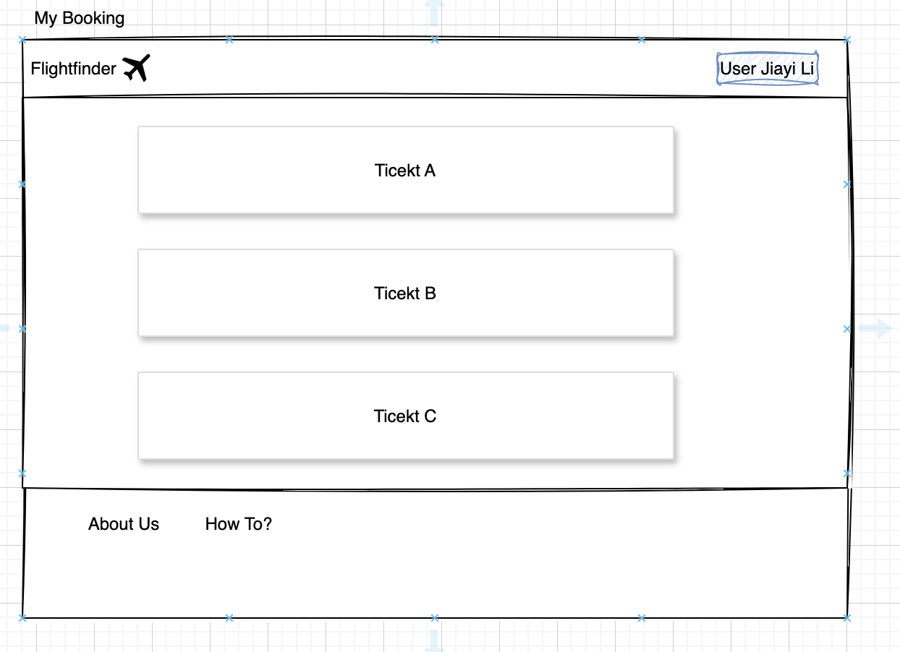

# Flight Finder

## Overview
FlightFinder is a user-friendly platform that simplifies the flight search process. The app is designed to reduce the frustration of finding flight tickets by offering a personalized experience that meets the specific needs and preferences of travelers.

### Problem Space

FlightFinder is essential because finding affordable flights can be frustrating and time-consuming for travelers.

Travelers often face challenges like:
- Navigating multiple booking websites
- Comparing numerous flight options
- Dealing with constantly changing prices
- Limited flight availability

These issues can make it difficult and stressful to find the best flight deals. FlightFinder addresses these problems by simplifying and streamlining the flight search process.

### User Profile

FlightFinder is designed for travelers, especially international students, who find searching for affordable flights frustrating and time-consuming.

### Features

#### 1. **Flight AirportSearch Functionality**
**Feature:** Users can search for flights by entering details like departure and destination cities, travel dates, and number of passengers.  
**User Story:** As a user, I want to search for flights by specifying my departure city, destination, and travel dates, so I can find available flights that match my needs.

---

#### 2. **Flight Filters**
**Feature:** Provide filtering options such as price range, number of stops, airline, departure/arrival times, and baggage policies.  
**User Story:** As a user, I want to filter my search results by price, number of stops, airline, and other factors, so I can find the best flight for my preferences.

---

#### 3. **Sort Options**
**Feature:** Allow users to sort flight results by price, duration, or best match.  
**User Story:** As a user, I want to sort my search results by price, duration, or best match, so I can easily find a flight that fits my budget or schedule.

---

#### 4. **Flight Details**
**Feature:** Provide detailed information for each flight, including flight times, layovers, baggage info, and policies.  
**User Story:** As a user, I want to view detailed flight information, so I can make an informed decision before booking my flight.

---

#### 5. **Multi-City AirportSearch**
**Feature:** Enable users to search for multi-city or round-trip flights.  
**User Story:** As a user, I want to search for multi-city or round-trip flights, so I can plan a more complex itinerary with multiple destinations.

---

#### 6. **Real-Time Price Updates**
**Feature:** Display real-time flight prices that update automatically as users interact with filters or select options.  
**User Story:** As a user, I want to see real-time price updates that change dynamically as I apply filters or adjust my search criteria.

---

#### 7. **User Accounts and Booking History**
**Feature:** Allow users to create accounts, save preferences, and access their booking history.  
**User Story:** As a user, I want to create an account, save my search preferences, and view my booking history, so I can easily access my past flights and preferences in the future.

---

#### 8. Mobile-Friendly Design
**Feature:** Make sure the website is responsive and functions smoothly on mobile devices.  
**User Story:** As a user, I want to easily search and book flights on my mobile device so that I can plan my trip while on the go.

## Implementation

### Tech Stack

#### **Frontend**

- **Node.js**
- **React**
- **JavaScript**

### **Backend**
- **Java**
- **Python**
- **Express.js**

#### **Database**

- **Azure  DB**
- **Microsoft SQL Server**
- **MySQL**

#### **Cloud Platform**

- **Microsoft Azure**

#### **Libraries**

- **Frontend**:
    - **React Router**
    - **Axios / Fetch API**
    - **Material-UI / Ant Design**

- **Backend**:
    - **Spring Boot**

---
### APIs

- Amadeus
- AirLab
---
### Sitemap


### Mockups




### Data


### Endpoints


| API            | Endpoint Name                                           | Description                          |
|----------------|---------------------------------------------------------|--------------------------------------|
| **Flight API** | [POST /flight](#flight-create)                          | Create a flight record               |
| **Flight API** | [GET /flight/flightnumber/{flightnumber}](#flight-info) | Get flight info by flight number     |
| **Flight API** | [GET /flight/all](#flight-all)                          | Fetch all flights                    |
| **Offer API**  | [POST /offer/one](#offer-one)                           | Get offers for a specific route      |
| **Offer API**  | [POST /offer/matrix](#offer-matrix)                     | Get offer matrix for a route         |
| **Offer API**  | [POST /offer/create](#offer-create)                     | Create a new offer                   |
| **Offer API**  | [GET /offer/{key}](#offer-details)                      | Get offer details by key             |
| **Airline API**| [GET /airline/iata/{designator}](#airline-info)         | Get airline info by IATA designator  |
| **Airline API**| [GET /airline/all](#airline-all)                        | Fetch all airlines                   |

#### [POST /flight](#flight-create)
- **Description**: Create a flight record
- **Response**:
  ```json
  {
    "code": 0,
    "message": "string",
    "data": {
      "flightNumber": "string",
      "airlineCode": "string",
      "departAirport": "string",
      "departTerminal": "string",
      "departTime": "string",
      "arrivalAirport": "string",
      "arrivalTerminal": "string",
      "arrivalTime": "string",
      "duration": "string",
      "aircraft": "string"
    }
  }
  ```

#### [GET /flight/flightnumber/{flightnumber}](#flight-info)
- **Description**: Get flight info by flight number
- **Parameters**:
  - `flightnumber` (string): The flight number
- **Response**:
  ```json
  {
    "code": 0,
    "message": "string",
    "data": {
      "flightNumber": "string",
      "airlineCode": "string",
      "departAirport": "string",
      "departTerminal": "string",
      "departTime": "string",
      "arrivalAirport": "string",
      "arrivalTerminal": "string",
      "arrivalTime": "string",
      "duration": "string",
      "aircraft": "string"
    }
  }
  ```

#### [GET /flight/all](#flight-all)
- **Description**: Fetch all flights
- **Response**:
  ```json
  {
    "code": 0,
    "message": "string",
    "data": [
      {
        "flightNumber": "string",
        "airlineCode": "string",
        "departAirport": "string",
        "departTerminal": "string",
        "departTime": "string",
        "arrivalAirport": "string",
        "arrivalTerminal": "string",
        "arrivalTime": "string",
        "duration": "string",
        "aircraft": "string"
      }
    ]
  }
  ```

#### [POST /offer/one](#offer-one)
- **Description**: Get offers for a specific route
- **Response**:
  ```json
  {
    "code": 0,
    "message": "string",
    "data": {
      "id": "string",
      "airlineCode": "string",
      "departFlightSegments": "string",
      "returnFlightSegments": "string",
      "departAirport": "string",
      "returnAirport": "string",
      "departDate": "string",
      "returnDate": "string",
      "departDuration": "string",
      "returnDuration": "string",
      "price": 0,
      "currency": "string"
    }
  }
  ```

#### [POST /offer/matrix](#offer-matrix)
- **Description**: Get the offer matrix for a route
- **Response**:
  ```json
  {
    "code": 0,
    "message": "string",
    "data": [
      [
        {
          "id": "string",
          "airlineCode": "string",
          "departFlightSegments": "string",
          "returnFlightSegments": "string",
          "departAirport": "string",
          "returnAirport": "string",
          "departDate": "string",
          "returnDate": "string",
          "departDuration": "string",
          "returnDuration": "string",
          "price": 0,
          "currency": "string"
        }
      ]
    ]
  }
  ```

#### [POST /offer/create](#offer-create)
- **Description**: Create a new offer
- **Parameters** (in query string):
  - `id`, `airlineCode`, `departFlights`, `returnFlights`, `departAirport`, `returnAirport`, `departDate`, `returnDate`, `departDuration`, `returnDuration`, `price`, `currency`
- **Response**:
  ```json
  {
    "code": 0,
    "message": "string",
    "data": {
      "id": "string",
      "airlineCode": "string",
      "departFlightSegments": "string",
      "returnFlightSegments": "string",
      "departAirport": "string",
      "returnAirport": "string",
      "departDate": "string",
      "returnDate": "string",
      "departDuration": "string",
      "returnDuration": "string",
      "price": 0,
      "currency": "string"
    }
  }
  ```

#### [GET /offer/{key}](#offer-details)
- **Description**: Get offer details by key
- **Parameters**:
  - `key` (string): Unique identifier for the offer
- **Response**:
  ```json
  {
    "code": 0,
    "message": "string",
    "data": {
      "id": "string",
      "airlineCode": "string",
      "departFlightSegments": "string",
      "returnFlightSegments": "string",
      "departAirport": "string",
      "returnAirport": "string",
      "departDate": "string",
      "returnDate": "string",
      "departDuration": "string",
      "returnDuration": "string",
      "price": 0,
      "currency": "string"
    }
  }
  ```

#### [GET /airline/iata/{designator}](#airline-info)
- **Description**: Get airline info by IATA code
- **Parameters**:
  - `designator` (string): The IATA designator (e.g., "DL")
- **Response**:
  ```json
  {
    "code": 0,
    "message": "string",
    "data": {
      "iataDesignator": "string",
      "name": "string",
      "threeDigitCode": "string",
      "icaoDesignator": "string",
      "country": "string"
    }
  }
  ```

#### [GET /airline/all](#airline-all)
- **Description**: Fetch all airlines
- **Response**:
  ```json
  {
    "code": 0,
    "message": "string",
    "data": [
      {
        "iataDesignator": "string",
        "name": "string",
        "threeDigitCode": "string",
        "icaoDesignator": "string",
        "country": "string"
      }
    ]
  }
  ```

---


## Roadmap


[Capstone project Dashboard](https://github.com/users/jiayi-dev/projects/8)

### **[Iteration 1](https://github.com/jiayi-dev/capstone-project/milestone/1): Core Features and Basic Functionality**
**Time** - 1 Week

| Title                           | Assignees   | Status | Priority | Estimate (hrs) | Size |
|---------------------------------|------------|--------|----------|----------------|------|
| [API Integration (Flight API)](https://github.com/jiayi-dev/capstone-project/issues/7)    | jiayi-dev  | Backlog| P0       | 4              | M    |
| [Flight AirportSearch Functionality](https://github.com/jiayi-dev/capstone-project/issues/8)     | jiayi-dev  | Backlog| P0       | 2              | S    |
| [Flight Filters](https://github.com/jiayi-dev/capstone-project/issues/9)                  | jiayi-dev  | Backlog| P0       | 5              | M    |
| [Sort Options](https://github.com/jiayi-dev/capstone-project/issues/10)                    | jiayi-dev  | Backlog| P0       | 3              | S    |
| [Flight Details](https://github.com/jiayi-dev/capstone-project/issues/11)                  | jiayi-dev  | Backlog| P0       | 6              | M    |

---

### **[Iteration 2](https://github.com/jiayi-dev/capstone-project/milestone/2): QA & Bug-fix**
**Time** - 2 Days

| Title                           | Assignees   | Status | Priority | Estimate (hrs) | Size |
|---------------------------------|------------|--------|----------|----------------|------|
| [Mobile-Friendly Design](https://github.com/jiayi-dev/capstone-project/issues/16)          | jiayi-dev  | Backlog| P1       | 4              | M    |
| [Review and Deployment](https://github.com/jiayi-dev/capstone-project/issues/13)           | jiayi-dev  | Backlog| P1       | 4              | M    |

---

## Future Implementations
Your project will be marked based on what you committed to in the above document. Here, you can list any additional features you may complete after the MVP of your application is built, or if you have extra time before the Capstone due date.

